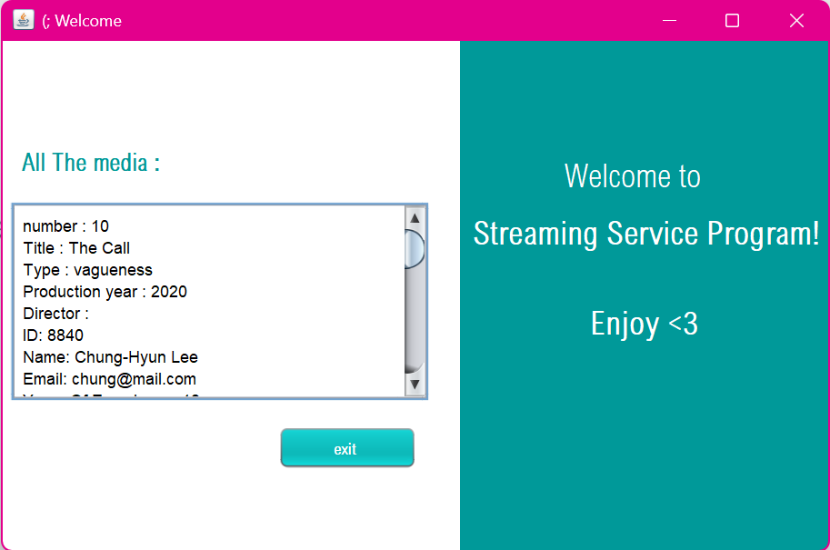

# Streaming Service Program (Java OOP)

A desktop-based streaming service system developed using Java.

## GUI Preview

Simple Java Swing interface displaying available media and basic controls.

## Features
- Manage Movies, Series, and Podcasts
- Add and remove media dynamically
- Episode management for series using Array and Composition
- Subscription system with multiple plans
- Payment calculation including VAT
- File handling to read and write data
- GUI using Java Swing

## Technologies Used
- Java
- Object-Oriented Programming (OOP)
- Encapsulation, Inheritance, Polymorphism, Abstraction
- Abstract Class: `Media`
- Interface: `Payable`
- ArrayList & Arrays
- Exception Handling
- File Handling
- Java Swing GUI

## Project Overview
This project demonstrates the implementation of a complete object-oriented system, including inheritance hierarchies, interfaces, abstract classes, composition, file handling, and user interaction through both console and GUI.

## How to Run
- Open the project in NetBeans
- Run `Main.java`
- Choose option `12` to launch the GUI

## Author
Saja Aljamal XD
